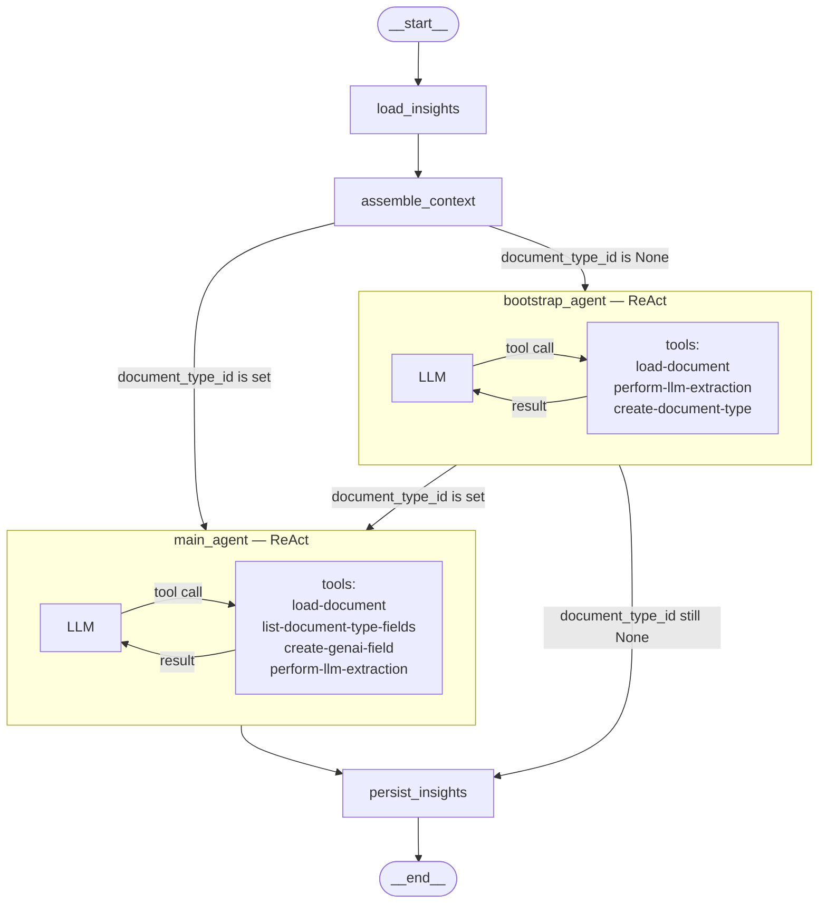

# GenAI Queries Agent

## Graph

### Nodes

| Node | Description |
|------|-------------|
| `load_insights` | Loads persisted insights from previous conversation turns |
| `assemble_context` | Injects insights as a `SystemMessage` into the message history |
| `bootstrap_agent` | ReAct agent used when no Document Type exists yet — creates it |
| `main_agent` | ReAct agent used when a Document Type already exists — manages fields and extraction |
| `persist_insights` | Summarizes the conversation and saves key insights for future turns |

### Routing

- **`assemble_context` → `bootstrap_agent`** — `document_type_id` is not set
- **`assemble_context` → `main_agent`** — `document_type_id` is already known
- **`bootstrap_agent` → `main_agent`** — agent successfully created a Document Type during the turn
- **`bootstrap_agent` → `persist_insights`** — agent could not create a Document Type (skips main agent)
